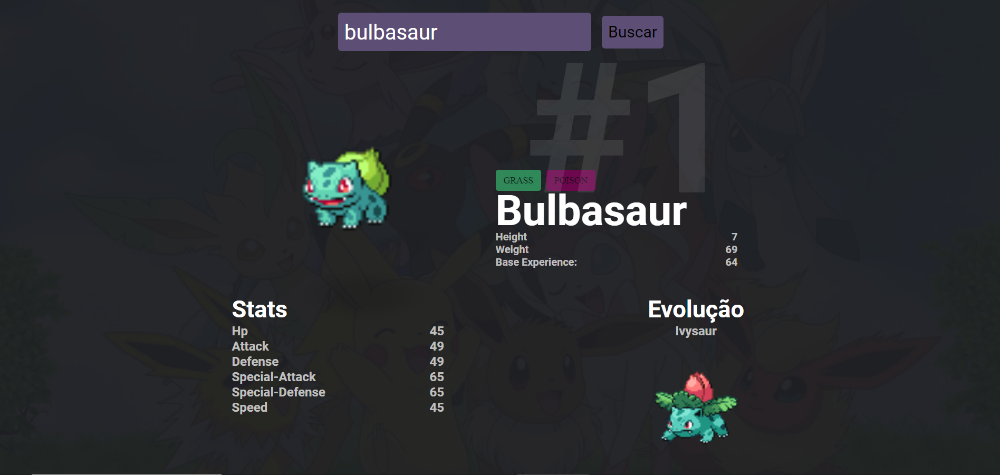

# **Projeto: Consumindo a PokeApi com Vue.js e Vuetify**

Este projeto tem como objetivo criar uma aplicação que consome a PokeApi e exibe informações sobre os Pokémons. A aplicação foi construída usando o framework JavaScript Vue.js e o framework de componentes UI Vuetify.

## **Recursos**

- Exibição de uma lista de Pokémons
- Exibição de detalhes de cada Pokémon, incluindo imagem, nome, tipo e habilidades
- Busca de Pokémons por nome
- Design responsivo e amigável ao usuário com o Vuetify

## **Instalação**

Para instalar e executar este projeto, você precisará ter o **[Node.js](https://nodejs.org/en/)** e o **[Vue CLI](https://cli.vuejs.org/)** instalados em sua máquina.

1. Clone este repositório para sua máquina
2. Abra o terminal e navegue até o diretório do projeto
3. Execute o comando **`npm install`** para instalar todas as dependências
4. Execute o comando **`npm run serve`** para iniciar o servidor de desenvolvimento
5. Acesse **[http://localhost:8080](http://localhost:8080/)** em seu navegador para visualizar a aplicação

## **Testando a API**

Este projeto consome a PokeApi, que fornece informações sobre Pokémons. Além de visualizar as informações na aplicação, você também pode testar as chamadas da API usando o **[Postman](https://www.postman.com/)**.

1. Abra o Postman
2. Crie uma nova requisição
3. Insira a URL da API (por exemplo, **[https://pokeapi.co/api/v2/pokemon/](https://pokeapi.co/api/v2/pokemon/)**)
4. Envie a requisição
5. Visualize e experimente as diferentes rotas da API para obter informações sobre Pokémons.

## **Licença**

Este projeto está licenciado sob a licença MIT. Mais detalhes estão disponíveis no arquivo **[LICENSE](https://chat.openai.com/LICENSE)**.

## **Contribuições**

Contribuições são sempre bem-vindas! Se você tem uma ideia de como melhorar este projeto, sinta-se à vontade para abrir uma issue ou enviar uma pull request.

## **Tela**

<a href="https://www.figma.com/file/KibAfTMQKVMWpCbQl9Eq08/Untitled?node-id=0%3A1&t=KGFRS1grj1bUWY92-1">Link do Figma</a>

## Autor

<a href="https://github.com/Francielefernandes06">
 
  
 <b>Franciele Fernandes</b></a> <a href="https://github.com/Francielefernandes06" title="GitHub">☕</a>

Feito com ❤️ por Franciele Fernandes 👋🏽 Entre em contato!

  
 

 
